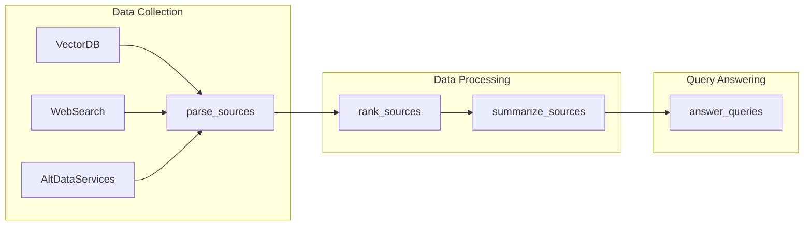

# **PlanGPT**

PlanGPT is an execution engine for autonomous large language model (LLM) based agents that enables them to devise non-linear, hierarchical plans of actions and execute them autonomously. It provides a high-level, declarative language for human and machine-readable action plans, which are defined using a subset of **[Mermaid.js](https://mermaid-js.github.io/)** - a markdown-inspired text definition language for creating flow diagrams. PlanGPT is designed with enhanced explainability, ensemble modeling, and best practice prompt engineering techniques such as reflexion and chain of thought in mind.

## **Background**

The main purpose of PlanGPT is to expand on the chain of thought technique used by LangChain and AutoGPT, providing a higher-level approach for orchestrating and planning different external functions using LLMs. PlanGPT allows users to define action plans in a markdown-based language, which is then executed by the PlanGPT execution engine. The execution engine creates task queues and concurrent workers to run the generated action plan, enabling LLMs to autonomously perform complex tasks.

## **How it Works**

PlanGPT takes a list of available external functions and turns user prompts into a markdown-based action plan. The action plan is defined using a subset of Mermaid.js syntax, which allows for human and machine-readable representation of the planned actions. The execution engine then processes the action plan, creating task queues and concurrent workers to execute the planned actions in a non-linear, hierarchical manner.

## **Why Mermaid.js**

PlanGPT leverages Mermaid.js for defining action plans due to several reasons:

- **GPT4 Compatibility**: GPT4, the underlying LLM used by PlanGPT, can already generate correct Mermaid.js syntax, making it a natural fit for defining action plans.
- **Widely Supported Format**: Mermaid.js syntax is widely supported in existing markdown renderers, making it easy to create, read, and share action plans with other developers and users.
- **Human-Friendly Visualizations**: Mermaid.js can automatically generate human-friendly visualizations of action plans, providing a clear and intuitive way to understand the planned actions and their relationships.

## **Example Use Case**

As an example, PlanGPT could be used for equity market research on a public company. The system could gather data from various sources such as a vector database, public web search, and third-party alternative data services. It could then rank and summarize the gathered sources, and finally answer semantic queries submitted by the user. The entire workflow could be defined as an action plan using PlanGPT's markdown-based language, enabling the LLM to autonomously execute the defined actions in a non-linear, hierarchical manner.

```
flowchart LR

subgraph "Data Collection"
  VectorDB --> parse_sources
  WebSearch --> parse_sources
  AltDataServices --> parse_sources
end

subgraph "Data Processing"
  parse_sources --> rank_sources
  rank_sources --> summarize_sources
end

subgraph "Query Answering"
  summarize_sources --> answer_queries
end
```
